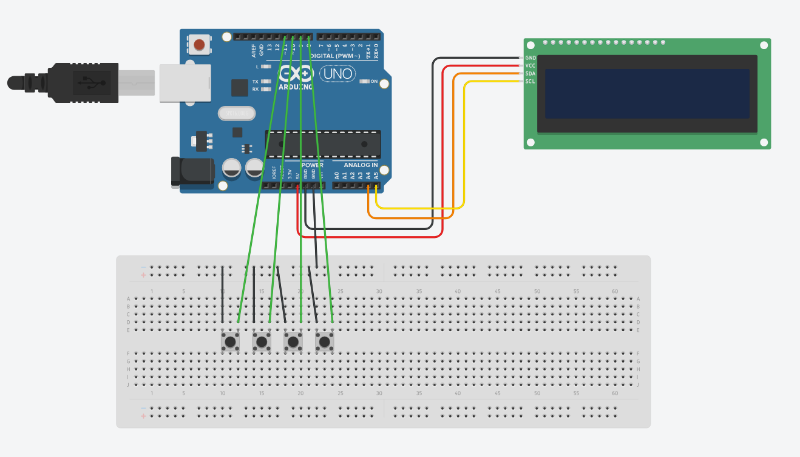

# Stopwatch-Project
Arduino-based digital stopwatch with lap time functionality.

## Overview:
This project is an Arduino-based digital stopwatch which is developed during my 2nd year of Btech as a microproject. The stopwatch is capable of showing lap times, demonstrating the implementation of timing functions, button interfacing and display control in embedded systems.

## Features:
1. Start
2. Stop/pause 
3. Reset
4. Show lap time

## Components Used:
1. Arduino Uno
2. 16*2 LCD display with I2C module
3. Push buttons
4. Breadboard
5. Jumper wires
6. Power supply

## Software Used:
Arduino IDE

## How it Works:
1. Press the start button to begin.
2. Press the stop button to pause.
3. press the reset button to start again.
4. Press the lap button to show the elapsed time.

## Files:
`stop_watch_withI2C.ino` - Main Arduino program

`README.md` - Project documentation

## Circuit Diagram:

## Learning Outcomes:
1. Arduino programming
2. Embedded systems development
3. Timer implementation
4. Hardware interfacing
5. Project design and testing

## Contributors:
1. Mannya K
2. Kavya Ravi T

Developed collaboratively as a 2nd year micro-project

## License:
This project is shared for educational and learning purposes.
